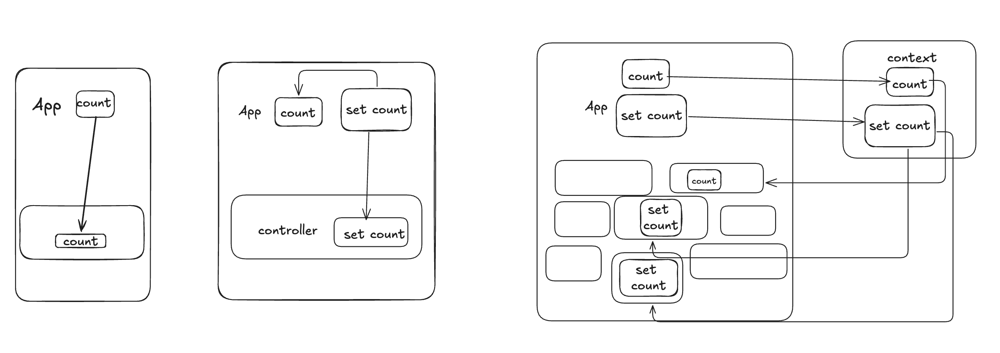

# 06 状态的传递

> 课程目的
>
> - 了解状态传递的方式
> - 理解并熟悉不同关系的组件之间的状态传递方式

## 1. 父传子

React 是单向的数据流，因此我们可以将父的状态传递给子组件。  
[father-child.jsx](./father-child.jsx)
 左一

## 2. 子传父

虽然 React 是单向数据流，但是我们可以通过回调函数的方式让子组件通知父组件更改状态。

[child-father.jsx](./child-father.jsx)
 中间

## 3. context

可用于父子、兄弟的跨组件、跨级别的状态传递，但是要求所有想要消费这个状态的组件都要在这个 Context 的 Provider 下。

*[context.jsx](./context.jsx)
 右一

## 状态管理方案

虽然 React 的 hook 设计的足够应付大部分小场面，但是当组件之间的关系变得复杂，状态传递变得困难时（尤其是要横跨大半个页面甚至是横跨页面的时候），就需要一种更好的抽象来管理状态，这时候就需要引入**状态管理方案**。

古早的状态管理方案如 Redux、Mobx 在当今逐渐被当作历史的垃圾被遗弃，其中 Redux 为了其「设计」而过分繁琐被人诟病，而 Mobx 因为长期逆反 React 的设计理念，在新版本的 React 中几乎无法继续使用。

在近几年，有两个状态管理库分别以不同的理念和设计模式脱颖而出：

### Zustand

这个是现代版本的 Redux，它的设计理念是「状态是一个树，但是你只需要关心你需要的那一部分」，因此它的 API 设计得非常简单，只需要一个 `create` 函数就可以创建一个状态树。

一个全局状态的声明被简单抽象成了一个函数，这个函数返回一个对象，这个对象就是状态树，状态树中有 data 和 action，当你需要更新状态时，只需要调用 action 就可以了，而 data 可以直接在组件中使用。

观察代码：[zustand.jsx](./zustand.jsx)

`useStore` 的第一个参数被称为选择器，可以理解为用于监听状态树的某一部分，或是取出某个 action。只有被选中监听的 data 更新才会影响这个组件的重新渲染。

### Jotai

这个是一个基于原子状态的状态管理库，它的设计理念是「状态是原子的，通过原子的组合就能构建出复杂的状态」，因此它构建出的状态也别具一格。

因为设计比较精妙，需要补充大量概念，因此仅做兴趣参考，不作为课程内容。[jotai.jsx](./jotai.jsx)
