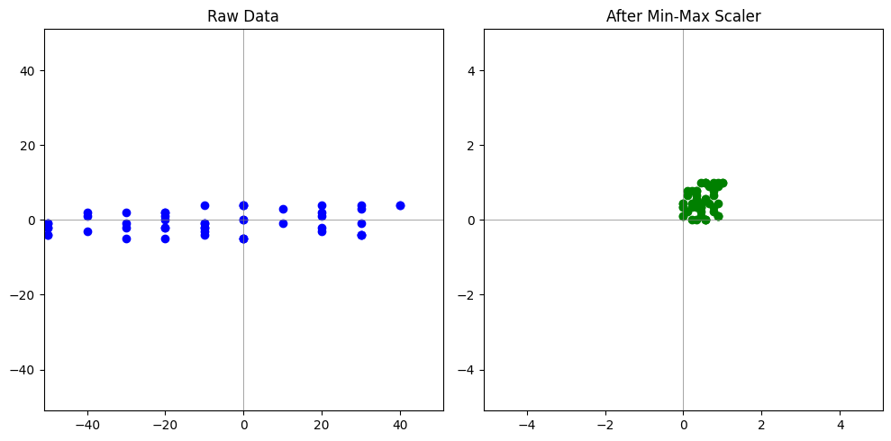
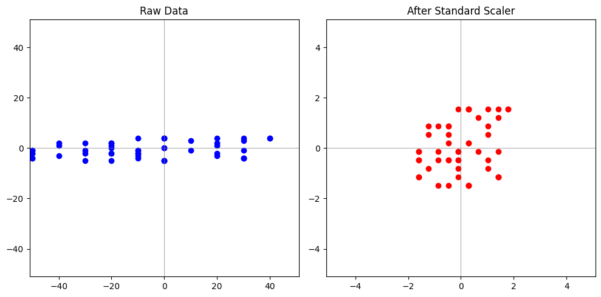

# 前言

## 机器学习

机器学习：让计算机从数据或经验中自动学习规律，并用学到的东西去解决问题。它是人工智能的一个分支，旨在开发算法和模型，使系统能够根据数据进行预测、分类或决策。

机器学习的流程：

* **需求分析**：明确要解决的问题，确定目标和评价指标。
* **数据收集和处理**：获取与问题相关的高质量数据。
* **模型构建和训练**：根据问题类型（如回归、分类、聚类）和数据特点，构建合适的机器学习算法。
* **模型评估和优化**：评估训练好的模型性能，并根据评估结果进行优化。
* **部署和应用**：将最终模型部署到生产环境中，以实际应用。

# 01. 数据预处理

[sklearn](https://scikit-learn.org/stable/index.html)

<center>
  <div style="width: 100%; heigth: 20vh;">
    </img>
  </div>
</center>

> 课程目的：
> - 初步接触 sklearn
> - 了解**归一化**的两种方法：最值归一、标准化
> - 了解**降维**的两种方法：PCA（主成分分析）、SVD（奇异值分解）
> - 了解**数据集划分**

Scikit-Learn 是机器学习算法库，提供了大量常用的机器 学习算法，涵盖分类、回归、聚类、降维等各类任务需求，能与其他常用的 Python 库如 NumPy、Pandas 和 Matplotlib 高度兼容，是机器学习领域的标配工具。

```sh
pip install scikit-learn
```

## 什么是数据预处理

**数据预处理**指：在机器学习的训练前对数据进行处理，将“垃圾数据”处理成“干净数据”。

现实世界的数据采样的过程中将常出现各种错误、缺失值、异常值和噪音，并且这些数据的可能有会分布不均匀，过于稀疏等情况。

常见的数据预处理操作有：数据清洗（**python base 04**）、归一化、数据降维、数据集划分等。  


## 1. 归一化

在实际应用中，往往会建立模型对不同特征的数据进行特征学习。
> 例如：通过身高、体重学习人的特点，而不同特征的数据由于单位（量纲）不同，数值范围相差大（分布不均匀）。数值同样为 2，但身高 2m 会很高，体重 2kg 却很低，导致模型出现权重不平衡的问题。

因此，为了使各特征中分布不均的数值能够统一的反映出在对应单位下的真实情况，需要对这些数据进行**无量纲化**操作，也即**归一化**。

**通过归一化处理的数据，其分布更加均匀，往往训练模型的效果更好。**

常见的归一化方法有两种：

### 最大-最小归一化（Min-Max Scaling）



将数据线性的映射到[0, 1]

* 具体公式：$x^* = {x - \min(x) \over \max(x) - \min(x)}$，其中$x$是原始数据，$x^*$是归一化后的数据。
* 特点：
  * 线性变换，保留数据的相对比例（最大值为1，最小值为0）
  * 对异常值非常敏感，特别是当异常值为**最值**时。
* **使用场景**：
  * 数据无明显偏差、且数值相对紧凑时
  * 使用模型需要**基于距离**计算时

### 标准化（Z-score Normalization）



将数据映射到均值为0，方差为1的标准**正态分布（高斯分布）**

* 具体公式：$x^* = {x - \mu \over \sigma}$，其中$\mu$是数据的均值，$\sigma$是数据的方差  
* 特点：
  * 归一化后的数据取值范围为 $[-\infin, +\infin]$（正负皆有），但总体呈现标准正态分布
  * 对异常值不敏感
* **使用场景**：
  * 当数据分布存在**明显偏移**时（指各个特征的均值和方差相差很大）
  * 适用于基于**线性**假设的模型，如**线性回归、逻辑回归**等
  * 当不知道用哪种归一化方法时，通常标准化会更稳定

归一化代码实现：  
[normalization.ipynb](./normalization.ipynb)


## 2. 数据降维

*当拿到的数据维度很高，且比较稀疏或有噪音时（真实的信息量远小于数据的维度），可以对数据进行降维。*

数据降维旨在**减少数据的特征数量**，又尽可能保留重要信息。这对于高维数据非常有用，能够降低数据的复杂性，减少模型计算时间，还可以防止模型的过拟合（学到不该学的噪音等）。

常见的降维方法有两种（特殊情况下可相互转化）：

### PCA（主成分分析）

通过**线性变换**将数据从**高维空间**映射到**低维空间**，同时尽可能保留原始数据的方差。目标是找到数据中主要的方向，使得数据在这些方向上方差最大（**方差越大信息越多**（分布更加的散））。

* PCA 步骤（不用理解，保留印象）：  

  1. **数据去中心化**：对于一个特征矩阵 $X \in \mathbb{R}^{n \times d}$，其中$n$是样本数，$d$是特征数。

     去中心化后的数据为：$X_{\text{centered}} = X - \mu$，其中，$\mu$是**特征的均值向量**。

  2. **协方差矩阵**：计算去中心化后的协方差矩阵$\Sigma$：$\Sigma = \frac{1}{n-1} X_{\text{centered}}^T X_{\text{centered}}$，$\Sigma \in \mathbb{R}^{d \times d}$ 反映了特征之间的**相关性**。

  3. **特征值分解**：对协方差矩阵$\Sigma$进行**特征值分解**：$\Sigma v_i = \lambda_i v_i$，其中，$\lambda_i$ 是第 $i$个特征值，$v_i$是对应的特征向量。

  4. **降维变换**：选择前$k$个最大的特征值，使用对应的特征向量 $v_1, v_2, \dots, v_k$构成主成分矩阵 $V_k$。

  将数据投影到新的低维空间：$X_{\text{pca}} = X_{\text{centered}} V_k$，其中，$X_{\text{pca}}$​是降维后的数据矩阵。

> 使用场景
> * 数据中的主成分是**线性组合**的，不适合处理**非线性数据**
> * 数据中的**方差具有**足够的**意义**
> * 当特征数**n**远小于样本数**m**时（计算比SVD更快）。

### SVD（奇异值分解）

利用矩阵分解技术，将一个矩阵分解为三个矩阵的乘积，用于理解和处理数据的潜在结构。

* SVD  步骤（不用理解，保留印象）：

  1. **矩阵分解**：对于一个矩阵 $A \in \mathbb{R}^{m \times n}$，它可以被分解为三个矩阵的乘积：$A = U \Sigma V^T$，其中：
  - $U \in \mathbb{R}^{m \times m}$ 是左奇异向量矩阵。
    
  - $\Sigma \in \mathbb{R}^{m \times n}$ 是对角矩阵，其对角线上的值为奇异值。
    
  - $V^T \in \mathbb{R}^{n \times n}$ 是右奇异向量矩阵。
  
  
    2. **奇异值**：$\Sigma$中的奇异值 $\sigma_i$ 是矩阵 $A$ 的重要性度量，按从大到小排列。每个奇异值与对应的奇异向量共同决定了数据的主要方向。
    3. **低秩近似**：通过选择前 $k$ 个最大的奇异值，可以得到矩阵的低秩近似：$A_k = U_k \Sigma_k V_k^T$，其中$U_k$ 和  $V_k$分别是前 $k$ 个奇异向量，$\Sigma_k$ 是对应的奇异值。
  

> 使用场景  
> * 应用更广泛，可以处理非线性数据。  
> * 当特征数**n**接近样本数**m**时（计算比PCA更快）。  

SVD 代码实现：[dimension_reduction.ipynb](./dimension_reduction.ipynb)


## 3. 数据集划分

为了确保数据对训练有效，我们通常将数据划分为**训练集**和**测试集**，分别用于训练模型、测试模型。这主要是为了避免“**过拟合**”问题。

> **过拟合**是指模型在训练数据上表现得过分卖力，但在新的、未见过的数据上表不佳。通常是因为模型记住了训练数据中的噪声，而不是学到了数据中的真正规律。

通常，训练集和测试集的划分比例为`7:3`或者`8:2`。
数据集划分代码实现：[dataset_split.ipynb](./dataset_split.ipynb)