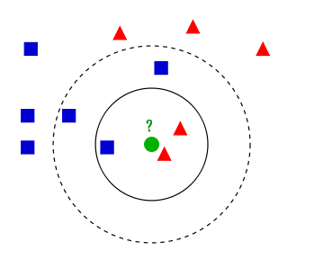
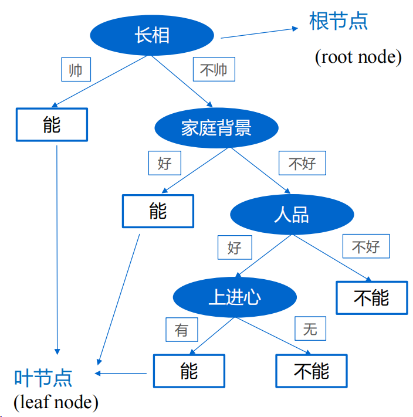

# 02. 传统分类算法

> 课程目的：
>
> * 明白什么是分类：根据已有的数据来判断未知数据的类别
> * 学会典型传统分类算法KNN，决策树和随机森林的大致工作原理以及使用方法

## 分类任务

*通过学习已标记的数据，找到输入特征与输出类别之间的映射关系，从而能够对新的未知数据做出正确的分类预测（将数据分配到不同的类别或标签中）。*

> 假设你要教孩子分辨苹果和橘子。你给他看很多苹果和橘子，告诉他哪些是苹果，哪些是橘子。孩子观察这些水果的形状、颜色等特征，慢慢学会了区分。机器学习的分类算法和这个过程类似。

例如，我们手里有一些关于鸢尾花特征和类别的数据：

| 花萼长度（cm） | 花萼宽度（cm） | 花瓣长度（cm） | 花瓣宽度（cm） |     类别     |
| :------------: | :------------: | :------------: | :------------: | :----------: |
|      5.1       |      3.5       |      1.4       |      0.2       |    山鸢尾    |
|      5.0       |      3.6       |      1.4       |      0.2       |    山鸢尾    |
|      7.0       |      3.2       |      4.7       |      1.4       |   变色鸢尾   |
|      6.9       |      3.1       |      4.9       |      1.5       |   变色鸢尾   |
|      5.7       |      2.5       |      5.0       |      2.0       | 维吉尼亚鸢尾 |
|      5.8       |      2.8       |      5.1       |      2.4       | 维吉尼亚鸢尾 |

可以看到：  
三类花的花萼长度分别在 5、7、6 cm，花萼宽度分别在 3.5、3.2、3.1 cm，花瓣长度分别在 1.4、4.7、4.9 cm，花瓣宽度分别在 0.2、1.4、1.5 cm。它们在数据上有明显的区分特征。

现在，我们拿到一个新的未知数据如下：

| 花萼长度（cm） | 花萼宽度（cm） | 花瓣长度（cm） | 花瓣宽度（cm） | 类别 |
| :------------: | :------------: | :------------: | :------------: | :--: |
|      4.8       |      3.0       |      1.1       |      0.1       |  ？  |

可以发现，因为其各个特征和山鸢尾比较相似，因此我们倾向于预测其类别为山鸢尾（事实上也的确是山鸢尾）。

这基本就是整个分类任务通常会面临的情景。

> 注意：为了便于介绍，这里所给的例子是很简单直观的，而实际应用中所遇到的数据，**特征复杂且无法肉眼直观特征**，因此需要利用机器学习模型去预测。

传统的机器学习分类算法有：
- KNN
- 朴素贝叶斯
- SVM
- 决策树
- 随机森林
- ...

许多算法如今已经被取代，基本已成为了历史。因此，在这里我们重点学习现在仍然会在一些场景使用到的机器学习算法。


## KNN(K-Nearest Neighbors)

*非常简单直接，但很有启发性的算法*

**核心思想**：**“看邻居”**。给定一个待分类的数据点，找到在训练集中与它距离最近的K个数据点，多数邻居是什么类别，新数据就是什么类别。



#### 算法流程

1. 计算测试样本与训练集中每个样本的距离，并按照距离的远近排序
2. 选取与当前测试样本最近的k个训练样本，作为该测试样本的邻居
3. 统计这k个样本的类别频次，频次最高的类别，即为测试样本的类别

#### 距离计算（快速过，有印象即可）

* 曼哈顿距离：$d(x, y) = \sum\limits_{l=1}^n(|x^{(l)} - y^{(l)}|)$
* 欧式距离（最常用）：$d(x, y) = \sqrt{\sum\limits_{l=1}^n(x^{(l)} - y^{(l)})^2}$

> 曼哈顿距离：L1范数，即各维度 **1 次方之和**的 1 次根（各维度边长和）  
> 欧氏距离：L2范数，即各维度 **2 次方的和**的 2 次根（各维度边长平方和的二次根）  

KNN 代码：[KNN.ipynb](./KNN.ipynb)

## 决策树

*一种用树形结构做出决策的算法。*

**核心思想**：根据数据的特征通过对其逐步分裂，以树形结构做出决策，一步步选择，从而将数据分类到不同的类别。

例如，下面是关于“根据一个人的特点，判断是否能和他谈恋爱“的决策树：




#### 算法流程

1. 从所有特征中选择一个最佳的特征进行划分。
   * **核心思想**：通过概率计算，找出能够最好地区分不同类别的数据特征，例如”长相“。
   * 选择算法常用的有：ID4, C4.5, CART（感兴趣可以自己去搜索）
2. 根据这个特征把数据分成不同分支。
3. 对每个分支重复上述步骤，直到所有数据被正确分类或没有更多特征可供选择。
4. （可选）对决策树进行剪枝操作。
   * **原因**：为了尽可能正确分类训练样本，节点的划分过程会不断重复直到不能再分，这样就可能对训练样本学习的“太好”了，把训练样本的一些特点当做所有数据都具有的一般性质，从而导致过拟合。（例如，可能”上进心“并不是考虑的要求，只是恰好训练集里存在该现象）

决策树代码：[decision_tree.ipynb](./decision_tree.ipynb)


## 随机森林

*由多棵决策树组成的模型，“大家投票”决定结果*

**核心思想**：通过结合多棵决策树的预测结果，利用多数投票的方式让每棵决策树做出自己的分类判断，决定最终的分类结果。

#### 算法流程

1. 随机生成多个决策树，每棵树使用**不同的**数据子集。
2. 对于新数据，让每棵树都给出分类结果。
3. 多数决策树的结果就是最终的分类。

随机森林代码：[random_forest.ipynb](./random_forest.ipynb)


## sklearn训练模型总结

使用sklearn创建并训练机器学习模型的范式通常为：

1. 导入模型：
```py
from sklearn.xxx import xxx
```
2. 数据预处理：数据加载、清洗、预处理、数据集划分
```py
X_train, X_test, y_train, y_test = train_test_split(X, y, test_size=0.3)
```
3. 创建模型：
```py
model = xxx()
```
4. 训练模型：
```py
model.fit(X_train, y_train)
```
5. 模型预测：
```py
y_pred = model.predict(X_test)
```
```py
score = accuracy_score(y_test, y_pred)
```