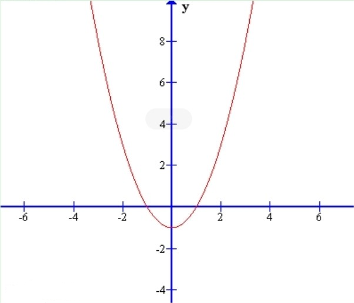
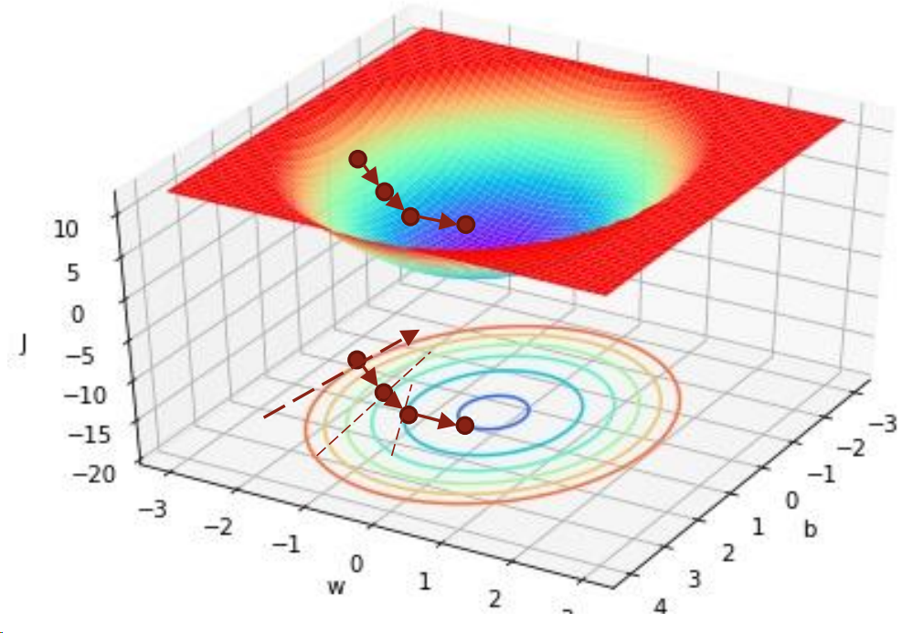
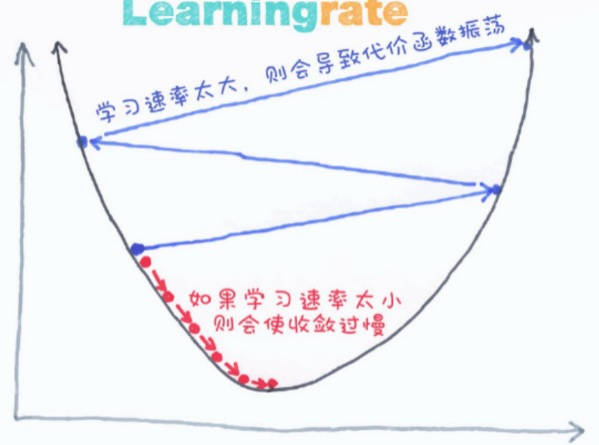

# 03. 线性回归

> 课程目的：
>
> * 明白什么是回归：预测连续值的输出
> * 学会线性回归的原理以及使用方法
> * 知道什么是梯度下降

## 回归任务

*在机器学习中，**“回归”** 是一种根据已有数据预测**连续数值型**变量的方法。与分类不同，分类是预测**离散类别**（如猫狗分类），而回归是预测一个**连续数值**（如房价、气温、销售额等）。*

> 房子产经纪人想预测房价。**面积、房间数、房龄是特征，而房价是目标。** 房价是连续的数值，没有固定的取值范围，因此和分类不同。回归分析就是用数学的方法去寻找特征和目标之间的关系，帮助你更好地预测未来的数据。

例如，我们手里有一些房屋信息的数据：

|   房屋面积   |   50    |   80    |   100   |   120   |   150   |   90    |   110   |   130   |  100   |  140  |
| :----------: | :-----: | :-----: | :-----: | :-----: | :-----: | :-----: | :-----: | :-----: | :----: | :---: |
| **房间数量** |  **2**  |  **3**  |  **3**  |  **4**  |  **4**  |  **3**  |  **4**  |  **5**  | **3**  | **4** |
| **房屋年龄** | **10**  |  **8**  | **15**  | **15**  | **20**  | **12**  |  **7**  |  **3**  | **10** | **5** |
|   **房价**   | **180** | **240** | **260** | **300** | **350** | **280** | **320** | **360** | **?**  | **?** |

可以看到：房屋面积大，房间数量多，房屋年龄小，房价会更高。

这就是回归任务所需要解决的问题，通过肉眼，我们可以预测一个大概，但具体的值是多少，则需要通过数学方法建立模型进行更精确的分析和预测。

> 同样，为了便于介绍，这里所给的例子是很简单直观的，而实际应用中所遇到的数据，特征可能会十分复杂。

求解回归任务的模型有很多，最常用的则是**线性回归**和**神经网络**，也是我们这个课要讲的模型。

## 线性回归

***线性回归**是一种最简单的回归方法，它假设特征和目标变量之间的关系可以用一条**直线**表示。

**核心思想**：试图找到一个最佳的“**直线**”，以便用特征（如面积、房间数、房龄）来预测变量（如房价）。

数学上，这条直线的方程是：$y = w_1 \cdot x_1 + w_2 \cdot x_2 + \dots + w_n \cdot x_n + b = \Sigma (w_i \cdot x_i)+b$​

* $y$ 是我们要预测的目标（房价）。
* $x_1, x_2, ..., x_n$ 是特征（面积、房龄等）。
* $w_1, w_2, ..., w_n$ 是特征对应的权重，描述了每个特征对目标值的影响程度（**是要学习的参数**）。
* $b$ 是偏置，描述了当所有特征为0时，预测值是多少（**同样是需要学习的参数**）。

> 在本例中它的特征变量有三个（面积、房间数、房龄），无法在平面坐标系上绘制出这条直线，但它在高维空间中仍然是以一条直线的形式存在（因为多项式次数为 1），学过线性代数的同学应该可以理解。

在实际应用中，我们更喜欢用**矩阵形式**来表示，即：$\vec{y} = X \cdot \vec{w}$

* 其中，第 i 行某样本$\vec{x_i} = [x_{i1}, x_{i2}, \dots, x_{in}, 1]$，参数$\vec{w_i} = [w_{i1}, w_{i2}, \dots, w_{in}, b]^T$(等价变换，可以把 $b$ 也算到参数 $w$ 里)
* 当只有一个样本时，$X$是一个行向量；当有多个样本时，$X$是一个矩阵，**每一行代表一个样本**。
* 当只有一个样本时，$\mathbf{y}$是一个值；当有多个样本时， $\vec{y}$是一个列向量，**每一列代表一个样本的预测值**。

## 损失函数

### 如何评判模型预测的有多准确？

通常用**损失函数**评估模型的优劣，损失函数越低，效果越好——前提是你的损失函数定义合理。

### 模型要怎么去学习自己的参数？

定义了**损失函数**后，损失函数就成了一个**指导**目标，指导模型的学习。因此接下来的工作就变成了优化问题：**求损失函数最小时模型的参数值**。

### 回归任务中的损失函数

在回归任务中，最常用的损失函数是**均方误差（MSE, Mean Squared Error）**
> $MSE = {1 \over 2} \sum\limits_{i=1}^m(\hat y_i - y_i)^2$

* $m$ 是样本的数量，$\hat y_i$ 是第 $i$ 个样本的**预测值**，$y_i$ 是第 $i$ 个样本的真实值。

* 该损失函数可以反映出模型在**所有样本上的总体误差**情况

* 该函数是一个**二次函数**

  

其矩阵形式为：$MSE = {1 \over 2}(\mathbf{\hat y} - \mathbf{y})^T(\mathbf{\hat y} - \mathbf{y}) = {1\over 2}(\mathbf{y} - X\mathbf{w})^T(\mathbf{y} - X\mathbf{w})$

### 最小化损失值

*在定义好损失函数后，整个回归任务则变成了**最小化损失值**。（找到一组参数 $\mathbf{w}$ 和 $\mathbf{b}$ ，使得损失值最小）*

#### 直接求导法

在中学和高等数学中我们都学过，求一个二次函数最值的方法是对其求导，并令其导数为0，此时参数对应的函数值则为最小值。因此，用同样的方法，我们对损失函数进行求参数的偏导（会用到矩阵求导法则）：

${\partial J(\mathbf{w}) \over \partial \mathbf{w}} = X^TX \mathbf{w} - X^T \mathbf{y}$

令其为$\mathbf{0}$，即：

$X^TX \mathbf{w} = X^T \mathbf{y}$，

求解得：

$\mathbf{w} = (X^TX)^{-1} X^T\mathbf{y}$

> **直接求导·优点**：一步求得最优解，方便精准。
>
> **直接求导·缺点**：仅适用于小规模问题。如果数据量非常大或特征非常多，求解过程可能会非常耗时甚至不可行（矩阵求逆的复杂度是$O(n^3)$）。

线性回归预测：[direct.ipynb](./direct.ipynb)

> 用直接求导法求解上面的例子，设：
>
> $X = \begin{bmatrix}50 & 2 & 10 & 1\\ 80 & 3 & 8 & 1 \\ 100 & 3 & 5 & 1 \\ 120 & 4 & 15 & 1 \\ 150 & 4 & 20 & 1 \\ 90 & 3 & 12 & 1 \\ 110 & 4 & 7 & 1 \\ 130 & 5 & 3 & 1\end{bmatrix}$，$\mathbf{y} = \begin{bmatrix} 180 \\ 240 \\ 260 \\ 300 \\ 350 \\ 280 \\ 320 \\ 360\end{bmatrix}$，$\mathbf{w} = \begin{bmatrix} w_1 \\ w_2  \\ w_3  \\ b\end{bmatrix}$​
>
> 因此，由 $\mathbf{w} = (X^TX)^{-1} X^T\mathbf{y}$ 得：
>
> $w_1 \approx 2.41$，$w_2 \approx -14.61$，$w_3 \approx -4.38$，$b \approx 136.42$

#### 梯度下降法

当数据量过大无法使用直接求导法进行求解时，可以考虑迭代的方式用梯度下降法进行学习。梯度下降法也是当今所有的深度学习模型在学习时都会用到的方法，非常重要。

梯度下降法可以看作一个“下山”的过程，当目前的值处于“半山腰”时，让通过寻找合适的方向，让其一直往“最低点”走，直到取到最小值。

* **往什么方向走是合适的？**
> 下降最快的方向，而下降最快（变化率最大，导数的模）就是**梯度方向**。

* **梯度？**
> 梯度的本意是一个向量（矢量），表示某一函数在该点处的方向导数沿着该方向取得最大值，即函数在该点处沿着该方向（此梯度的方向）变化最快，变化率最大。

* **学习率？**
> 在梯度下降的过程中，步子大了进不去洞，步子小了原地踏步。需要设置一个**步长**，也叫做**学习率**。通常为 0.01、0.001。

  

因此，梯度下降的参数更新公式为：${\mathbf{\bar w} = \mathbf{w} - \alpha \nabla f(\mathbf{w})}$，其中：

* $\mathbf{w}$是旧的参数值，$\mathbf{\bar w}$是新的参数值，$\nabla f(\mathbf{w})$是$\mathbf{w}$的梯度（导数），$\alpha$​是学习率。
* 重复迭代计算$\mathbf{w}$，直到达到预设的迭代次数或收敛（$\mathbf{w}$​基本不再变化）为止。

> **梯度下降·优点**：由于它不需要对所有数据点一次性求解，适用于大规模数据集，且可以用于无法求得解析解的问题。
>
> **梯度下降·缺点**：需要选择一个合适的学习率，且对参数和输入数据值的大小较为敏感，不宜过大或过小。

梯度下降：[gradient.ipynb](./gradient.ipynb)

> 用直接求导法求解上面的例子，设：
>
> $X = \begin{bmatrix}50 & 2 & 10 & 1\\ 80 & 3 & 8 & 1 \\ 100 & 3 & 5 & 1 \\ 120 & 4 & 15 & 1 \\ 150 & 4 & 20 & 1 \\ 90 & 3 & 12 & 1 \\ 110 & 4 & 7 & 1 \\ 130 & 5 & 3 & 1\end{bmatrix}$，$\mathbf{y} = \begin{bmatrix} 180 \\ 240 \\ 260 \\ 300 \\ 350 \\ 280 \\ 320 \\ 360\end{bmatrix}$，$\mathbf{w} = \begin{bmatrix} w_1 \\ w_2  \\ w_3  \\ b\end{bmatrix}$​
>
> 初始化 $\mathbf{w} = \begin{bmatrix} 0 \\ 0 \\ 0 \\ 0\end{bmatrix}$
>
> 迭代：
>
> ${\mathbf{\bar w} = \mathbf{w} - \alpha \nabla f(\mathbf{w})}$，其中：$\nabla f(\mathbf{w}) = X^TX \mathbf{w} - X^T \mathbf{y}$

sklearn的实现方式：[linear_regression.ipynb](./linear_regression.ipynb)