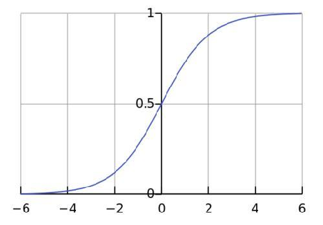
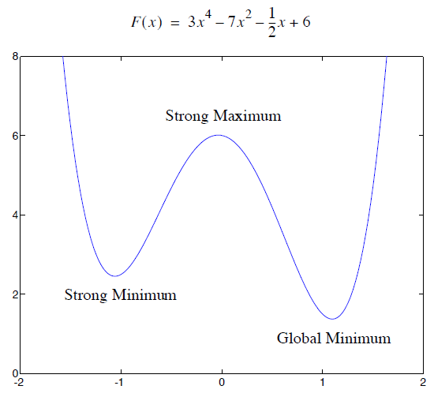
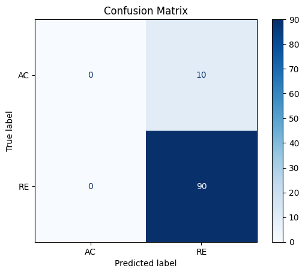

# 04. 逻辑回归：处理**二分类**任务

> * 学会逻辑回归的原理以及使用方法
> * 知道什么是混淆矩阵

## 二分类任务

在 **02. 传统分类算法** 课上我们学过，分类任务就是通过学习已标记的数据，找到**输入特征**与**输出类别**间的映射关系，从而将样本分配到不同的标签中。  
二分类任务，则是特指将输入数据分配到 **两个互斥** 类别的任务。  

> 假设银行审核信用卡申请，申请人需要提供信息，目标是根据过去收集到的客户审批结果，建立审批标准，对新的申请人进行二分类预测：批准（类别 1）或拒绝（类别 0）。

现在，我们手里有一些历史审批数据：

| 年龄（岁） | 年收入（万元） | 信用评分（0-100） | 是否有不良信用记录（0=否，1=是） | 审批结果（0=拒绝，1=批准） |
| ---------- | -------------- | ----------------- | -------------------------------- | -------------------------- |
| 24         | 27             | 88                | 0                                | **1**                      |
| 39         | 56             | 58                | 1                                | **0**                      |
| 32         | 30             | 82                | 0                                | **1**                      |
| 29         | 33             | 73                | 0                                | **0**                      |
| 42         | 66             | 89                | 1                                | **1**                      |
| 34         | 36             | 80                | 0                                | **0**                      |

需要根据历史数据建模审批标准，以此来判断什么情况下批准申请，什么情况下拒绝申请，并审批下面的新申请人：

| 年龄（岁） | 年收入（万元） | 信用评分（0-100） | 是否有不良信用记录（0=否，1=是） | 审批结果（0=拒绝，1=批准） |
| ---------- | -------------- | ----------------- | -------------------------------- | -------------------------- |
| 32         | 30             | 80                | 0                                | **?**                      |
| 40         | 63             | 86                | 1                                | **?**                      |

一个简单的二分类任务大体如此，可以从历史数据中大致判断新申请人的审批结果。然而，当历史审批数据新引入了更多的个人信息，或者新申请人有100个、1000个甚至更多时，用人工去判断会变得十分困难，成本极高。因此，同样需要建立机器学习模型去学习和判断（分类）。

一个非常经典的二分类模型是**逻辑回归**模型，从这个模型中，就可以看到一点神经网络的影子了。

## 逻辑回归

*虽然名字里有“回归”二字，但逻辑回归用于**分类**而不是回归。逻辑回归从线性回归演化而来，在线性回归中，输出的是一个连续的值，而在逻辑回归中，我们希望输出的是两个类别（例如“0”或“1”）。*

**核心思想**：给二分类的结果赋予置信度，**将线性回归的输出转换为0~1之间的概率**。

### 如何映射到概率？

试想一下用一个函数将线性回归映射到0-1之间的概率需要满足什么条件：

* 定义域要是$[-\infty, +\infty]$，因为线性回归的输出可能是任意值。
* 值域必须是$(0, 1)$，因为要映射到0~1之间的概率。
* 必须可导，因为需要使用直接求导法或者梯度下降法优化参数。
* 需要平滑、单调，概率的映射应该与线性回归输出的趋势相关，而不能随意映射。

经过前人的大量研究、试验，满足上述条件，且在大量的实际应用中起到好效果的**Sigmoid函数**被用到了逻辑回归当中。

### Sigmoid函数

 Sigmoid函数的其公式为：$\sigma(z)={1 \over {1 + e^{-z}}}$

该函数满足上面所提到的所有条件，可以将任意实数$z$​压缩到 (0, 1) 之间，因此可视作为0~1间的概率。

这里的$z$则指的是线性回归的输出，因此逻辑回归的**完整数学表达式**为：

$$y = \sigma(Xw) = {1 \over {1 + e^{-Xw}}}$$

### 交叉熵损失

*我们完全可以像线性回归那样对待逻辑回归，用其计算历史数据的均方误差，优化其最小值的参数，训练模型并使用。*

然而，逻辑回归的输出是一个**概率值**，在概率统计这门课中我们学过，衡量概率分布的差异有**专门的计算公式**，那就是**极大似然估计**。对其进行等价变换，既可以精准反映概率值的损失，也就是我们的**交叉熵损失**，其公式如下：

$$
CrossEntropy = -{1 \over n} \sum \limits _{i=1}^n \left[ y_i \log(\hat{y_i}) + (1 - y_i) \log(1 - \hat{y_i}) \right]
$$

$y_i$ 为样本 $i$ 的真实值，$\hat y_i$ 为样本 $i$ 的预测值。

可以看到，当真实标签为 1 时，该损失为 $-\log(\hat y_i)$ ；当真实标签为 0 时，该损失为 $-\log(1-\hat y_i)$。与真实标签偏离的越远，损失值越大，因此我们的目标仍然是**优化其最小值**。

> 0~1 之间使用均方误差的值普遍偏小，可能会导致浮点数溢出丢失精度

### *凸函数

> 此部分只做普及，不做教学要求。毕竟《凸优化理论》是可以讲一本书的

在逻辑回归中使用sigmoid函数和交叉熵损失，还有另一个原因，则是因为它们都是**凸函数**。

在最优化理论中，**凸函数**是这样定义的：

一个定义在凸集 $C \subseteq \mathbb{R}^n$ 上的函数 $f: C \to \mathbb{R}$ ，如果对于任意的$x_1, x_2 \in C$ 以及 $\lambda \in [0, 1]$，该函数满足以下不等式：

$$f(\lambda x_1 + (1 - \lambda) x_2) \leq \lambda f(x_1) + (1 - \lambda) f(x_2)$$

则函数 $f$ 被称为 **凸函数**

- $C$ 是一个凸集，即$C$ 中任意两点的任意线性组合 $\lambda x_1 + (1 - \lambda) x_2$也在 $C$ 中
- 凸函数的**几何解释**：连接 $f(x_1)$​ 和 $f(x_2)$ 的直线在函数图像的上（下）方，说明函数图像始终“向上弯曲”，即呈现出 **凹（凸）形**。

  

**凸函数的重要性质**：

* **局部极小值即全局最小值**：在凸函数的优化问题中，任何局部极小值同时也是全局最小值，这使得优化问题更加简单。

  

  * 一个非凸的函数可能存在多个极值，其导数都为0，这样会导致使用梯度下降法时，容易将模型参数锁定到极值上，而非最值上。

* **凸性的保持**：凸函数的非负线性组合、最大值、以及加法都保持凸性。

> 总结来说，凸函数确保了优化问题中只存在**一个全局最优解**，使得使用梯度下降等优化方法时更为**高效稳定**。

### 梯度下降法

同线性回归一样，在确立了合理的损失函数后，便可以使用梯度下降法开始学习模型参数。

* 逻辑回归：

  $\mathbf{z} = X\mathbf{w}$

  $\mathbf{\hat y} = \sigma(\mathbf{z}) = {1 \over 1 + e^{-\mathbf{z}}}$

* 损失函数：

  $L = -{1 \over n}\sum\limits_{i=1}^n[y_i\log(\hat y_i) + (1-y_i)\log(1-\hat y_i)]$

梯度下降法的核心是要求出损失函数（我们习惯设其为 $L$）对参数（$w$）的偏导数 $\partial L \over \partial w$：

${\partial L \over \partial w} = {\partial L \over \partial z} \cdot {\partial z \over \partial w} = {1\over n}X^T(\sigma(\mathbf{z})-\mathbf{y}) = {1\over n}X^T({1 \over {1 + e^{-X\mathbf{w}}}}-\mathbf{y})$

有了偏导数后，则可以设置学习率 $\alpha$ 并执行梯度下降算法：

1. 初始化参数 $w$（随机初始化或者全为0）
2. 更新参数：$w = w - \alpha \cdot {\partial L \over \partial w}$
3. 重复更新，直至达到指定次数或收敛

具体实现可以看代码：[logist.ipynb](./logist.ipynb) 和 [logist_sklearn.ipynb](./logist_sklearn.ipynb)的逻辑回归部分

通过我们的计算，我们得到逻辑回归的参数 $w$ 为：$[-18.09,\ \ 2.73,\ \ 7.80,\ \ -4.13]$

因此对于上面示例的数据，我们可以分别算出其被审批的概率：

| 年龄（岁） | 年收入（万元） | 信用评分（0-100） | 是否有不良信用记录（0=否，1=是） | 审批结果（0=拒绝，1=批准） |
| ---------- | -------------- | ----------------- | -------------------------------- | -------------------------- |
| 32         | 30             | 80                | 0                                | **0.67**                   |
| 40         | 63             | 86                | 1                                | **0.78**                   |

通常情况下，对于二分类问题，我们将分类概率大于0.5的视作1，小于0.5视作0，来完成真正的二分类任务，因此：

| 年龄（岁） | 年收入（万元） | 信用评分（0-100） | 是否有不良信用记录（0=否，1=是） | 审批结果（0=拒绝，1=批准） |
| ---------- | -------------- | ----------------- | -------------------------------- | -------------------------- |
| 32         | 30             | 80                | 0                                | **1**                      |
| 40         | 63             | 86                | 1                                | **1**                      |

## 混淆矩阵

#### 如何评判逻辑回归在二分类任务上的好坏？

*在一般情况下，我们可以用准确率评估。*

但是，试想一下，如果新的审批人有90个需要拒绝，只有10个同意，而用一个只会输出0的模型来审批，计算其准确率发现竟然有90%，这能说明这个模型已经学习的比较好了吗？

因此，在二分类任务中（其实不管几分类任务都类似）不能够仅仅只看准确率，还应当看其错误分类的具体情况。**混淆矩阵**则可以很好的去分析这一点：

二分类的混淆矩阵是一个2x2的方阵，该方阵的左上、左下、右下、右上四个格子里的数分别代表的含义为：

* **真正类 (TP)**：模型正确预测为正类的样本数（0）。
* **假正类 (FP)**：模型错误地将负类预测为正类的样本数（0）。
* **真负类 (TN)**：模型正确预测为负类的样本数（90）。
* **假负类 (FN)**：模型错误地将正类预测为负类的样本数（10）。

从混淆矩阵可以看到，在本应该同意审批（AC）的样本里，模型给出拒绝决策的有10个，而同意的却一个也没有，因此模型在AC样本里的效果是很差的。当然，对于不同情况，可以查看其不同指标，分类任务中可以计算的指标有：

* **准确率 (Accuracy)**：所有预测中正确预测的比例。

  $\text{准确率} = \frac{TP + TN}{TP + TN + FP + FN} = 0.9$​

* **精确率 (Precision)**：模型预测为正类的样本中，真正为正类的比例。

  $\text{精确率} = \frac{TP}{TP + FP} = 0$

* **召回率 (Recall)**：真实为正类的样本中，被正确预测为正类的比例。

  $\text{召回率} = \frac{TP}{TP + FN} = 0$

* **F1-score**：精确率和召回率的调和平均值，综合评估模型的性能，尤其在类别不平衡的情况下。

  $\text{F1-score} = 2 \times \frac{\text{精确率} \times \text{召回率}}{\text{精确率} + \text{召回率}} = 0$

可以看到，上述模型除了准确率以外，其它指标都很差。

用sklearn绘制混淆矩阵的代码见[logist_sklearn.ipynb](./logist_sklearn.ipynb)的混淆矩阵部分
