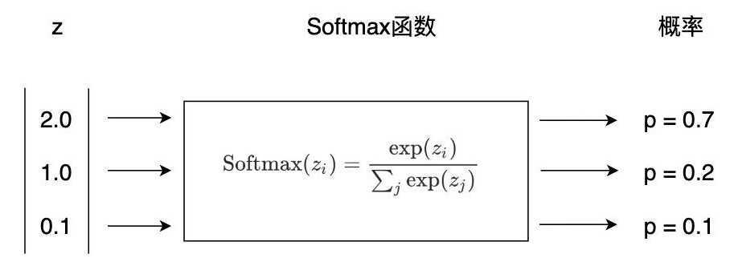

# Softmax 回归

> 课程目的：
>
> * Softmax 回归的使用场景：处理**多分类**任务
> * Softmax 回归和逻辑回归的关系：Softmax 回归是一般形式的逻辑回归
> * Softmax 回归和神经网络的关系：Softmax 回归也可以看作单层神经网络
> * one-hot 向量
> * 学会 Softmax 回归的原理以及使用方法

*逻辑回归是一种用于**二分类问题**的算法，它能帮助我们区分两种类别。但现实生活中，很多问题不是简单的两类，而是**多分类**。例如，识别图片中的物体，它可能是“猫”、“狗”或者“鸟”等多种类别。*

## 多分类任务

> 在**02. 传统分类算法**这节课中，初步接触过多分类问题：我们做过的鸢尾花数据集，它有三个类别标签（山鸢尾、变色鸢尾和维吉尼亚鸢尾），事实上这就是一个多分类问题。因此我们继续回到我们的“老朋友”，鸢尾花数据集上。

| 花萼长度（cm） | 花萼宽度（cm） | 花瓣长度（cm） | 花瓣宽度（cm） |     类别     |
| :------------: | :------------: | :------------: | :------------: | :----------: |
|      5.1       |      3.5       |      1.4       |      0.2       |    山鸢尾    |
|      5.0       |      3.6       |      1.4       |      0.2       |    山鸢尾    |
|      7.0       |      3.2       |      4.7       |      1.4       |   变色鸢尾   |
|      6.9       |      3.1       |      4.9       |      1.5       |   变色鸢尾   |
|      5.7       |      2.5       |      5.0       |      2.0       | 维吉尼亚鸢尾 |
|      5.8       |      2.8       |      5.1       |      2.4       | 维吉尼亚鸢尾 |

对于如下新的未知数据，我们仍然需要去判断其类别：

| 花萼长度（cm） | 花萼宽度（cm） | 花瓣长度（cm） | 花瓣宽度（cm） | 类别 |
| :------------: | :------------: | :------------: | :------------: | :--: |
|      4.8       |      3.0       |      1.1       |      0.1       |  ?   |

和典型传统分类算法所遇到的问题一模一样，这类问题的正式名字叫：**多分类任务**。

当手里的**训练数据非常多**时，除了传统分类方法外，还有一个更优异的算法解决多分类任务，那就是 **Softmax回归**。

## Softmax

*同样的，Softmax回归仍然用于**分类任务**而不是回归任务。*

在逻辑回归中我们学过，让模型去处理**二分类**任务时，将线性回归的输出转换成两个类别被选择的**概率**。那当类别不止两个的时候呢？反应快的人可能已经想到了，多分类任务<u>仍然也可以把线性回归的输出映射成概率，无非就是把两个概率变成多个概率，再选择所有类别中概率最大的作为最终答案</u>。

**既然如此，那么问题来了，线性回归的输出只有<u>一个值</u>，如何转换成多个概率呢？**

> *在二分类的时候，我们默认将这个值视作选择“1”的概率，自然而然地，选择“0”的概率就是用1减去这个值。然而在多分类任务中，该方法就行不通了。*

其实想法很简单，**既然一个线性回归只输出一个值，那多个线性回归不就有多个值了**。也就是说，当我们在做 $n$ 分类任务时，我们可以使用 $n$ 个**不同的线性回归**模型，计算出 $n$ 个值，每个值分别代表一个类别的概率，这样我们就得到了每个类别各自的概率了。

因此，我们的模型参数就不再是一个向量$\vec{w}$ ，而是一个**矩阵** $W$ （每一列代表一个线性回归模型的参数）：

$W = \begin{bmatrix} w_{11} & w_{12} & \dots & w_{1n} \\ w_{21} & w_{22} & \dots & w_{2n} \\ \vdots & \vdots &  \ddots & \vdots \\ w_{p1} & w_{p2} & \dots & w_{pn} \end{bmatrix}$，这里的 $W$ 表示，在 $n$ 分类的任务中，每个样本有 $p$ 个特征。

此时模型的输出也不再是一个向量 $\vec{z}$，而是一个**矩阵** $Z$（每一行代表一个样本，每一列代表一个类别的概率）：

$Z = \begin{bmatrix} z_{11} & z_{12} & \dots & z_{1n} \\ z_{21} & z_{22} & \dots & z_{2n} \\ \vdots & \vdots &  \ddots & \vdots \\ z_{m1} & z_{m2} & \dots & z_{mn} \end{bmatrix}$，这里的 $Z$ 表示，总共有 $m$ 个训练样本，每个样本的 $n$ 个类别各自的概率。

即，现在的“线性回归”变成了：$Z = X \cdot W$

### Softmax 函数

现在我们面临着当初和逻辑回归一样的问题：线性回归的输出是一个没有范围的连续值，而我们想要的是每个类别0~1之间的概率。     
**Sigmoid函数显然不再适用了**：Sigmoid只能将每一个类别自身的概率映射到0~1之间，而作为一个真正的概率分布，还应当让所有类别的概率之和为1，这显然是**Sigmoid办不到**的。

这就需要另一个函数： **Softmax 函数**。它除了具备 Sigmoid 函数所具备的性质外（**04. 逻辑回归**），还能保证每个类别的概率和为1。（Softmax 函数是该模型的核心，也是为什么这个模型叫 Softmax 回归的原因）

Softmax**公式**为：
$$
P(y=j | x_i) = {e^{Z_{ij}} \over \sum_k^n e^{Z_{ik}}}
$$
其中：

* $P(y = j | x_i)$ 表示，第 $i$ 个样本类别为 $j$ 的概率值。
* $Z_{ij}$ 表示第 $i$ 个样本在类别 $j$ 上的线性回归输出值。
* $\sum_k^n Z_{ik}$ 表示第 $i$​ 个样本**所有类别**的线性回归输出值**之和**。

* **Softmax 函数三个特点：**

1. Softmax 的输出是一组**概率分布**，每个类别的概率值介于0~1之间，且所有类别的概率和为1。
2. Softmax 使用指数运算，会使得较高得分对应的指数值会显著增加，增强了类别之间的区分能力。
3. Softmax 将所有类别的得分视为**彼此竞争**的关系。如果某个类别的得分增大，其他类别的得分相对减少。（这种竞争性特点在多分类问题中尤为重要）

在有了 Softmax 函数之后，整个模型也就建立起来了。因此 Softmax 回归的**完整表达式**为：

$$Z= XW \\ \hat Y = softmax(Z) = {e^Z \over sum(e^Z,\ \dim=1)}$$

* 其中 $sum(e^Z,\ \dim=1)$ 表示将 $e^Z$ 的每一行进行求和，其结果是一个向量（参照`python-base`中讲过的`numpy`的广播机制）

### 交叉熵损失

在逻辑回归中，我们已经学习过了交叉熵损失长什么样子：

$$CrossEntropy = -{1 \over m}\sum\limits_{i=1}^m[y_i\log(\hat y_i) + (1-y_i)\log(1-\hat y_i)]$$

由于当时的输出 $\hat y$ 是一个单值，因此如此使用它。而在现在我们在多分类任务中，每个样本输出的 $\hat y_i$ 是一个向量（向量中的每个值都代表一个类别的概率），因此无法像上面那样去计算。

> 在逻辑回归中我们分析过，交叉熵损失看起来比较复杂，但事实上对每一个类别进行计算的时候只会用到其中的一项，即：当 $y_i$ 为1时，该损失为$-\log(\hat y_i)$；当 $y_i$ 为0时，该损失为$-\log(1-\hat y_i)$。

我们可以参照此法去做等价变换，以简化表示形式。因此多分类任务中，交叉熵损失的公式为：

$$
CrossEntropy = -\frac{1}{m} \sum\limits_{i=1}^{m} \sum\limits_{j=1}^{n} \log(\hat{Y}_{ij}) \quad \text{ \{if } y_j \text{ = ture, else } 0 \}
$$

其意为：**交叉熵损失只会计算在真实类别预测上的损失**（优化该损失函数能同时优化模型在所有类别上的分类，参考 softmax 函数的第 3 个特点）

我们不能通过矩阵运算直接计算交叉熵损失，而需要通过遍历和判断的方式，来求和。

> 在`python`基础课讲`numpy`时我们讲过，python 的 for 遍历是非常慢的。因此在有性能要求的任务中应尽量避免使用，而转化为向量/矩阵运算以取代。

### 如何优化？

这涉及到真实标签如何表示的问题。如果还像以前，将类别表示为“0”, “1”, “2”…，在运算过程中一定会出现问题：这些数字是有大小关系的，如果用“1”表示“狗“，用“2”表示“猫”，能够因为$2 > 1$，说明猫比狗大吗？因此，让**无实意的编号影响运算**的表示方式是不合理的。

此外，还得考虑到在交叉熵损失的计算过程中，可以直接将标签转化成向量带入计算，且不影响运算结果，因此在这里我们引入了**One-Hot向量**。

### One-Hot向量

*一种用于表示分类标签的编码方式，其特点是，向量的长度为标签数，且只有真实标签一个位置为1，其余的位置都为0。*

比如：

- “猫”表为 $[1, 0, 0]$
- “狗”表为 $[0, 1, 0]$
- “鸟”表为 $[0, 0, 1]$

每个类别都用一个长度为 $3$ 的向量来表示，且每个向量中只有一个元素为 $1$，其余元素为 $0$。这样，每个向量之间不存在大小关系的比较，且将标签向量化，很好的避免了上述存在的问题。

在有了One-Hot向量之后，真实标签同样也不在是一个向量 $\mathbf{y}$，而变成了矩阵 $Y$（每一行代表一个样本的One-Hot向量）：

$Y = \begin{bmatrix} y_{11} & y_{12} & \dots & y_{1n} \\ y_{21} & y_{22} & \dots & y_{2n} \\ \vdots & \vdots &  \ddots & \vdots \\ y_{m1} & y_{m2} & \dots & y_{mn} \end{bmatrix}$，这里的 $Y$ 表示，总共有 $m$ 个训练样本，每个样本（每一行）只有一个值为 $1$，其余都为 $0$。

因此，交叉熵损失则变成了：

$$CrossEntropy = -{1 \over m}\sum\limits_{i=1}^m\sum\limits_{j=1}^n Y_{ij} \log(\hat Y_{ij}) = -{1 \over m}\sum\limits_{i=1}^m Y * \log(\hat Y)$$

* " $*$ ” 表示矩阵对应元素相乘，而不是矩阵乘法（同`numpy`里的写法）。

这样就成功优化成了矩阵相乘的形式。

#### 梯度下降法

同之前一样，在有了损失函数的表达式后，便可以使用梯度下降法开始学习模型参数。

* Softmax回归：

  $Z = XW$

  $\hat Y = {e^Z \over sum(e^Z,\ \dim=1)}$

* 损失函数：

  $L = -{1 \over m}\sum\limits_{i=1}^m Y * \log(\hat Y)$

损失函数（$L$）对参数（$w$）的偏导数 $\partial L \over \partial w$：

${\partial L \over \partial W} = {\partial L \over \partial Z} \cdot {\partial Z \over \partial W} = {1 \over m}(\hat Y-Y)X^T$

> 在求导数时须分别考虑 $y_{ij} = \hat y_{ij}$ 和 $y_{ij} \neq \hat y_{ij}$ 两种情况

有了偏导数后，则可以设置学习率 $\alpha$ 并执行梯度下降算法：

1. 初始化参数 $w$（随机初始化或者全为0）
2. 更新参数：$w = w - \alpha \cdot {\partial L \over \partial w}$
3. 重复更新，直至达到指定次数或收敛

具体实现的代码：[softmax.ipynb](./softmax.ipynb) 和 [softmax_sklearn.ipynb](./softmax_sklearn.ipynb)

## Softxmax 回归与逻辑回归的关系

**对于 Softmax 回归 和 逻辑回归：**
> 两者唯一的不同在于，Softmax 回归采用了多个线性映射并结合 Softmax 函数得到输出，而逻辑回归只有单个线性映射并结合 Sigmoid 函数得到输出。因此前者可以解决多分类问题，而后者只能解决二分类问题。

在 Softmax 解决二分类（0或1）时，对于输入 $x$ 预测其分类为 $1$​ 的概率为：
$$
P(y=1 | x) = {e^{z_1} \over e^{z_0} + e^{z_1}} = {e^{x \cdot w_1} \over e^{x \cdot w_0} + e^{x \cdot w_1}}
$$
分子分母同时除以 $e^{x_1 \cdot w_1}$：
$$
P(y=1 | x) = {1 \over 1 + e^{x \cdot w_0 - x \cdot w_1}} = {1 \over 1 + e^{x \cdot (w_0 - w_1)}}
$$
此时，令 $-w = w_0 - w_1$，则可以得到：
$$
P(y=1 | x) = {1 \over 1 + e^{- x \cdot w}}
$$
变成了逻辑回归的公式。

可以得出，Softmax 回归在解决二分类问题时可以转换为逻辑回归，即 **Softmax 回归是一般形式的逻辑回归**。

## Softxmax 回归与神经网络的关系

Softmax 回归的过程是对输入经过一次线性变换，再加上 Softmax 函数得到预测结果。尽管我们还没有学习神经网络，在这里可以先做个提示，神经网络无非就是将 Softmax 回归中的线性变换从一次变成多次，且中间穿插着非线性变换，最后仍然加上 Softmax 函数得到分类预测的结果。

因此，Softmax 回归其实可以看做**单层神经网络**。
