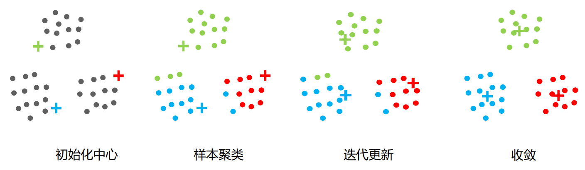
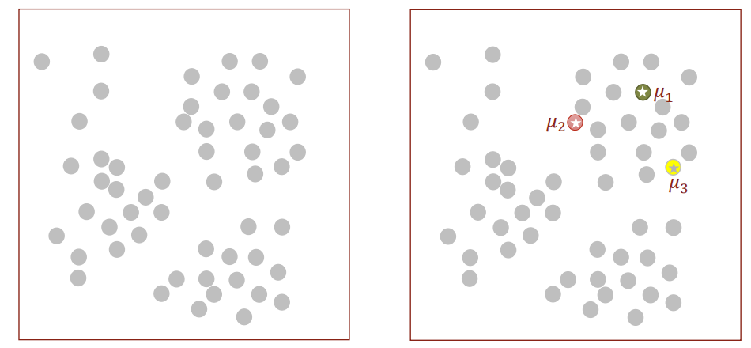
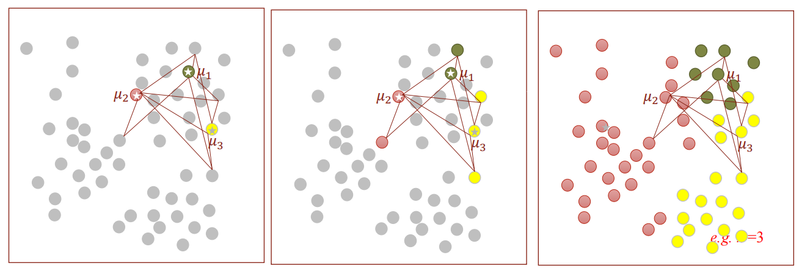
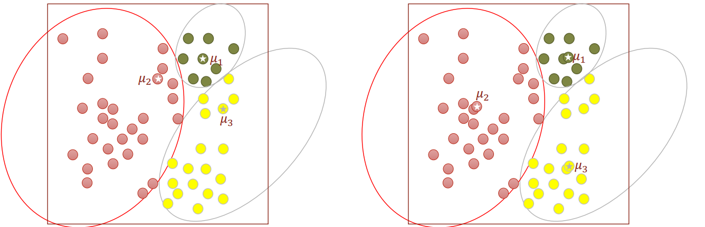
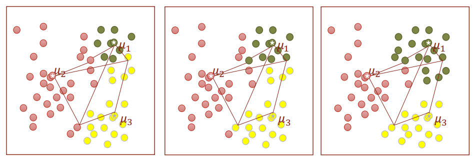
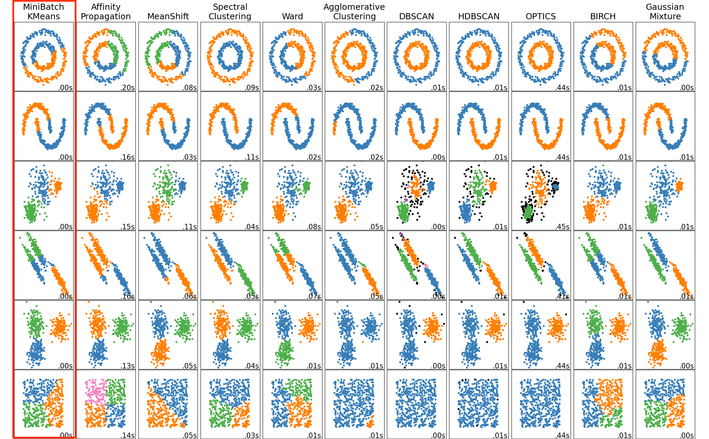
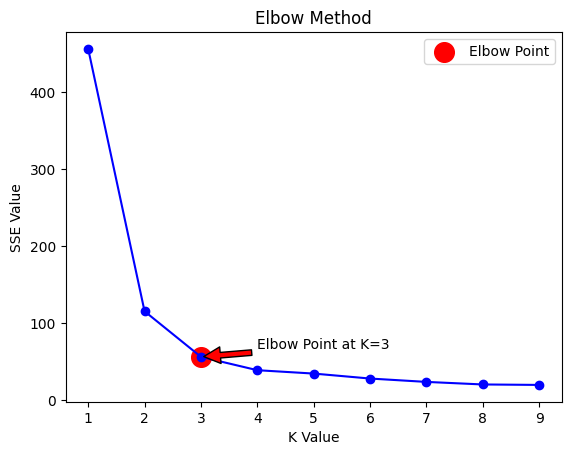

# K-means聚类

> 课程目的：
>
> * 机器学习的学习方式：监督学习、无监督学习和强化学习
> * 明白 K-means 的使用场景：无监督的**分类**任务（即聚类）
> * 学会 K-means 聚类的原理以及使用方法
> * 聚类任务的评价指标

## 机器学习的学习方式

回忆此前的**分类**和**回归**模型的共同点：

> 在开始时，我们会拿到**标注好**的数据，然后从它们的特征和对应标签中建立模型，去学习他们的映射关系，最后用训练好的模型预测未知数据的标签。这一类型的学习方式，有一个统一的名称，叫做：**监督学习**。

除此之外，机器学习的学习方式还有其它两种：**无监督学习**和**强化学习**。作为机器学习从业者，有必要了解这三种学习方式的**定义**：

* **监督学习**：通过**已标注的数据**进行训练，模型学习输入和输出之间的映射关系，从而对未知数据进行预测。
* **无监督学习**：在**没有标注的数据**中，模型通过寻找数据的内在结构或模式，进行分类、聚类或其他操作。
* **强化学习**：通过**与环境交互**获得反馈，模型通过试错学习来最大化某个目标函数的长期奖励。

> 可以看到我们之前所经历的所有分类和回归任务都属于监督学习的范畴。**01. 数据预处理**介绍的 PCA 和 SVD 数据降维方法，属于无监督学习的范畴。

*对于被标注标签的数据，我们已经学习了很多算法去分类。然而可能存在一些数据**没有标签**，并且也没人知道这些数据的标签是什么，但我们仍然需要给他们归类，以便于管理。这是之前所学的模型做不到的。*

因此，要用**无监督学习**算法去完成这样的分类任务（也叫做聚类任务）。接下来介绍一个最常用到的聚类模型：**K-means**。

## K-means

*K-means 用于将数据分成多个“簇”（clusters）。这些簇代表了数据中的自然分组，目标是使每个**簇内的数据点彼此相似度尽量高**，并使**不同簇的数据点差异尽量大**。*

**核心思想**：通过迭代不断更新每个簇的中心位置，最终将数据划分为K个相似的簇（距离相近的点为一个簇）。



让我们还是回到熟悉的鸢尾花数据集当中，但去掉类别：

| 花萼长度（cm） | 花萼宽度（cm） | 花瓣长度（cm） | 花瓣宽度（cm） | 类别 |
| :------------: | :------------: | :------------: | :------------: | :--: |
|      5.1       |      3.5       |      1.4       |      0.2       |  ?   |
|      5.0       |      3.6       |      1.4       |      0.2       |  ?   |
|      7.0       |      3.2       |      4.7       |      1.4       |  ?   |
|      6.9       |      3.1       |      4.9       |      1.5       |  ?   |
|      5.7       |      2.5       |      5.0       |      2.0       |  ?   |
|      5.8       |      2.8       |      5.1       |      2.4       |  ?   |

对于如下新的未知数据，我们仍然需要去判断其类别，不过这时我们只能判断它属于哪一簇相似的花里面：

| 花萼长度（cm） | 花萼宽度（cm） | 花瓣长度（cm） | 花瓣宽度（cm） | 类别 |
| :------------: | :------------: | :------------: | :------------: | :--: |
|      4.8       |      3.0       |      1.1       |      0.1       |  ?   |

我们可以简单地分析一下：

* 第1、2条数据可能聚为一类：花萼长度在5cm左右，花萼宽度在3.5cm左右，花瓣长度在1.5cm左右，花瓣宽度在0.2cm左右；
* 第3、4条数据可能聚为一类：花萼长度在7cm左右，花萼宽度在3.1cm左右，花瓣长度在5cm左右，花瓣宽度在1.5cm左右；
* 第5、6条数据可能聚为一类：花萼长度在6cm左右，花萼宽度在2.5cm左右，花瓣长度在5cm左右，花瓣宽度在2cm左右。

数据稀少（6条）的情况下，姑且可以用肉眼聚类，而当数据量庞大时（十万条），基本不可能。因此需要使用算法，将相似的数据自动聚类到一起。

> 想一想，如何将高维空间上距离相近的点聚为一类（如何去计算每一个聚类的中心）。

## 算法流程

1. **选择 K 个初始聚类中心**：确定参数 K，表示簇数量。然后**随机选择** K 个点作为初始的“簇中心”。

   
2. **分配每个数据点到最近的中心**：对于每一个数据点，计算它到 K 个中心的距离，将它分配到**最近的中心**所在的簇。

   
3. **重新计算每个簇的中心**：在每次数据点分配之后，重新计算每个簇的中心。新的中心是该**簇内所有点的平均值**。

   
4. **迭代—重复上述过程**：重复上面的分配和更新过程，直到簇的分配不再变化，或者达到预设的迭代次数。

   

> 其中，数据点之间的距离通常用的是**欧式距离**（**02. 传统分类算法**）。

具体代码实现：  
[kmeas.ipynb](./keams.ipynb)    
[kmeas_sklearn.ipynb](./keams_sklearn.ipynb)

从代码结果来看，即使我们没有任何数据标签，我们依然可以将未知数据分到和1、2条数据一个类别上去。

> 许多任务中，我们并不预知有多少类别。因此无法提前确定 K 的值。对于 K 如何确定，这节课的后续会介绍。

## K-means的优点

- 简单直观，易于理解和实现。
- 计算速度快，适合大规模数据。

## K-means的缺点

- 必须事先指定簇的数量 K，依赖人工经验。
- 对初始簇中心的选择敏感，不同的初始值可能会导致不同的聚类结果。
- 只适用于线性可分的数据，复杂的非线性分布可能无法有效划分。

  

  - 这里有sklearn中其它的聚类算法，在各种不同分布类型数据下的聚类效果，感兴趣的可以去 [scikit-learn.org/stable/modules/clustering.html](https://scikit-learn.org/stable/modules/clustering.html) 上查看和使用。


## 聚类任务的评价指标

*当完成分类任务时，通常手里都有数据的真实标签，我们可以根据模型预测的分类和真实标签进行对比，通过**准确率、精确率、召回率、F1-score**等一系列评价指标去评估模型的好坏。*

然而对于 k-means 这样的**聚类任务**模型而言，我们通常是没有任何数据的真实标签的。在这样的情况下，我们该如何评判模型好坏的效果呢？

### <a id="SSE">簇内平方误差和（SSE）</a>
*衡量每个数据点与其所属簇中心的距离之和。*

$$SSE = \sum\limits_{i=1}^{k} \sum\limits_{x \in C_i} ||x - \mu_i||^2$$

其中：
- $k$ 是簇的数量；

  $C_i$ 是第 $i$ 个簇；

- $x$ 是属于 $C_i$ 的数据点；

- $\mu_i$ 是 $C_i$ 的簇中心。

> SSE 越小，表示**簇内的点越接近簇中心，聚类效果越好**。然而，SSE 随着 K 值的增加通常会减小。因此，不能单独依赖 SSE 来确定最佳的 K 值。

* **在sklearn中，inertia 即 SSE 值**

```python
print("SSE 值 (Inertia):", kmeans.inertia_)
```

### 轮廓系数（Silhouette Score）
*衡量每个数据点在其簇内的紧密度与它与其他簇的分离度之间的关系*。

$$S = {1\over n}\sum\limits_{i=1}^n \frac{b_i - a_i}{\max(a_i,\ b_i)}$$

其中：
- $a$ 是数据点 ${i}$ 与其簇内其他点的平均距离；
- $b$ 是数据点 ${i}$ 与其最近的其他簇内所有点的平均距离。

> 轮廓系数的取值范围在 -1 到 1 之间：
>
> * 值接近 1 表示聚类效果很好，数据点非常紧密地聚在一起且远离其他簇。
> * 值接近 0 表示数据点在边界上，聚类效果一般。
> * 值为负表示数据点被分配到了错误的簇。

```python
from sklearn.metrics import silhouette_score

silhouette_avg = silhouette_score(X, kmeans.labels_)
print("平均轮廓系数 (Silhouette Score):", silhouette_avg)
```

### **CH 指数（Calinski-Harabasz Index）**
*根据簇内和簇间的方差比率来衡量聚类效果*。

$CH = \frac{Tr(B_k)}{Tr(W_k)} \cdot \frac{n - k}{k - 1}$

其中：
- $Tr(B_k)$ 是簇间的协方差矩阵的迹；
- $Tr(W_k)$ 是簇内的协方差矩阵的迹；
- $n$ 是数据点总数；
- $k$ 是簇的数量。

> CH 指数越大，表示聚类效果越好，簇内点聚得越紧凑，簇间差异越明显。

```python
from sklearn.metrics import calinski_harabasz_score

ch_score = calinski_harabasz_score(X, kmeans.labels_)
print("Calinski-Harabasz 指数:", ch_score)
```

总而言之，这些指标主要通过衡量**簇内数据点的紧密度和簇间数据点的分离度**来评估聚类模型的好坏。

完整代码看[kmeas_sklearn.ipynb](./keams_sklearn.ipynb)的评价指标部分。


## 如何选取聚类参数 K

*刚才我们提到，由于我们事先并不知道我们手中的数据到底有几个类别组成，因此在K-means中对于 K 的选取，我们是无从知晓的*。

为了选择适合的 K 值，常用的策略是**肘部法则**。

### 肘部法则（Elbow Method）

*通过计算不同簇数下的聚类效果，并观察效果变化的趋势，来帮助我们找到一个合理的 K 值。*

在肘部法则中，我们会计算不同 K 值下的聚类性能指标（通常是<a href="#SSE">SSE</a>），绘制出一条曲线，并观察曲线的形状来决定最佳的 K 值。

**肘部法则的具体操作步骤如下**：

1. 分别设置不同的簇数 K 并运行 K-means 算法，通常会从 K=1 开始逐步增加（比如 K 从1到10）。
2. 对于每一个 K，计算其 SSE。
3. 绘制 K 值和 SSE 的关系图，得到一条曲线。、
4. 观察曲线的形状。曲线的变化通常会呈现先急剧下降，然后逐渐趋缓的趋势。图中出现的“肘部”点（拐点，类似手肘的形状）对应的 K 值，就是最佳的簇数量 K。



用肘部法则对鸢尾花数据集进行聚类分析看到，确实也是在`K=3`的地方出现拐点，也就是说聚类得到的结果同样是有3个类别。

具体代码实现看[kmeas_sklearn.ipynb](./keams_sklearn.ipynb)的肘部法则部分。
